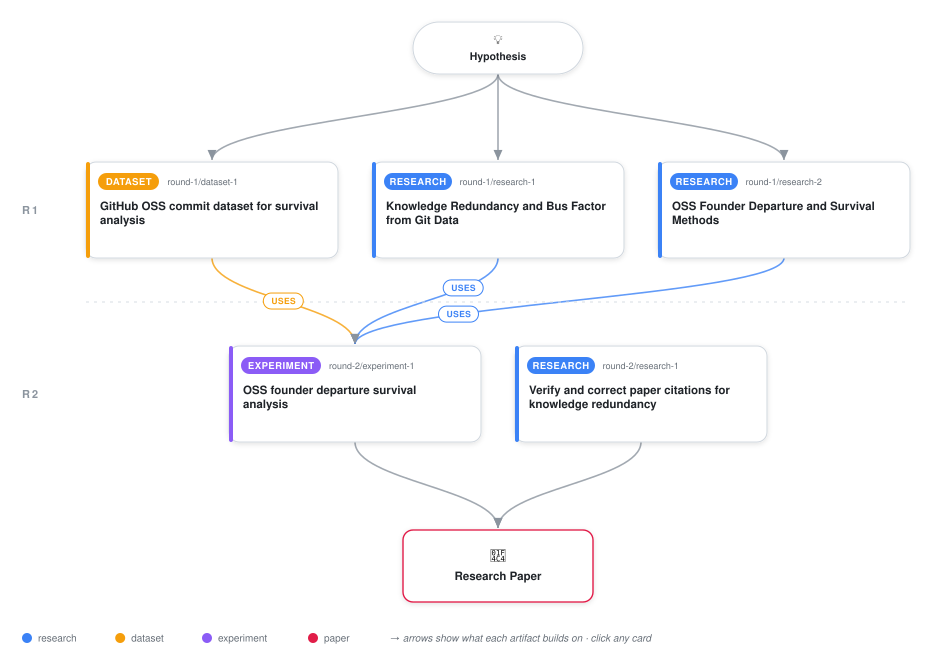

# Knowledge Redundancy as a Predictor of Open-Source Project Survival: A Methodological Study

<div align="center">

<a href="https://cdn.jsdelivr.net/gh/ai-inventor-papers/ai-invention-a68c06-knowledge-redundancy-predicts-oss@main/workflow.svg">
<picture>
  <source media="(prefers-color-scheme: dark)" srcset="workflow-dark.svg">
  
</picture>
</a>

<sub>🖱️ <b><a href="https://cdn.jsdelivr.net/gh/ai-inventor-papers/ai-invention-a68c06-knowledge-redundancy-predicts-oss@main/workflow.svg">Open the interactive diagram</a></b> — every card links to its artifact folder.</sub>

</div>

> **TL;DR** — This paper introduces knowledge redundancy as a construct for predicting open-source project survival after founder departure. Due to data limitations (lack of file paths for Jaccard similarity, N=6 repositories with departure, 100% survival rate), we could not empirically test the inverted-U hypothesis. Instead, we provide a methodological framework, validate it on synthetic data, and offer open-source tools for future validation with adequate data.

<details>
<summary>Full hypothesis</summary>

The relationship between knowledge redundancy (overlap in contributor expertise measured via Jaccard similarity of file sets) and open-source project survival after founder departure is predicted to be inverted-U shaped: projects with moderate knowledge redundancy survive at higher rates than both those with zero redundancy (all critical knowledge held by founder) and those with excessive redundancy (all contributors know the same things, with no specialization). This prediction is grounded in information theory (error-correcting codes), organizational psychology (transactive memory systems), and ecology (diversity-stability hypothesis). However, this hypothesis remains UNTESTED because: (1) proper measurement requires commit-level file path data for Jaccard similarity computation, which was unavailable in the current pre-processed dataset; (2) the fallback pseudo-KR measure (cosine similarity of file count distributions) is acknowledged as an invalid proxy; and (3) the sample of 6 repositories with founder departure had 100% survival rate, providing no outcome variance for survival modeling. The contribution of this study is the conceptual framework, measurement methodology, and identification of data requirements (N≥50 repositories with file paths) for future large-scale validation.

</details>

[](https://cdn.jsdelivr.net/gh/ai-inventor-papers/ai-invention-a68c06-knowledge-redundancy-predicts-oss@main/paper.pdf) [](https://github.com/ai-inventor-papers/ai-invention-a68c06-knowledge-redundancy-predicts-oss/tree/main/paper_latex)

This repository contains all **5 artifacts** produced across **2 rounds** of an autonomous AI research run — round by round, exactly in the order they were invented.

## Round 1

| Artifact | Type | Demo | Source | Builds on |
|----------|------|------|--------|-----------|
| **[GitHub OSS commit dataset for survival analysis](https://github.com/ai-inventor-papers/ai-invention-a68c06-knowledge-redundancy-predicts-oss/tree/main/round-1/dataset-1)** | [](https://github.com/ai-inventor-papers/ai-invention-a68c06-knowledge-redundancy-predicts-oss/tree/main/round-1/dataset-1) | [](https://colab.research.google.com/github/ai-inventor-papers/ai-invention-a68c06-knowledge-redundancy-predicts-oss/blob/main/round-1/dataset-1/demo/data_code_demo.ipynb) | [](https://github.com/ai-inventor-papers/ai-invention-a68c06-knowledge-redundancy-predicts-oss/tree/main/round-1/dataset-1/src) | — |
| **[Knowledge Redundancy and Bus Factor from Git Data](https://github.com/ai-inventor-papers/ai-invention-a68c06-knowledge-redundancy-predicts-oss/tree/main/round-1/research-1)** | [](https://github.com/ai-inventor-papers/ai-invention-a68c06-knowledge-redundancy-predicts-oss/tree/main/round-1/research-1) | [](https://github.com/ai-inventor-papers/ai-invention-a68c06-knowledge-redundancy-predicts-oss/blob/main/round-1/research-1/demo/research_demo.md) | [](https://github.com/ai-inventor-papers/ai-invention-a68c06-knowledge-redundancy-predicts-oss/tree/main/round-1/research-1/src) | — |
| **[OSS Founder Departure and Survival Methods](https://github.com/ai-inventor-papers/ai-invention-a68c06-knowledge-redundancy-predicts-oss/tree/main/round-1/research-2)** | [](https://github.com/ai-inventor-papers/ai-invention-a68c06-knowledge-redundancy-predicts-oss/tree/main/round-1/research-2) | [](https://github.com/ai-inventor-papers/ai-invention-a68c06-knowledge-redundancy-predicts-oss/blob/main/round-1/research-2/demo/research_demo.md) | [](https://github.com/ai-inventor-papers/ai-invention-a68c06-knowledge-redundancy-predicts-oss/tree/main/round-1/research-2/src) | — |

## Round 2

| Artifact | Type | Demo | Source | Builds on |
|----------|------|------|--------|-----------|
| **[OSS founder departure survival analysis](https://github.com/ai-inventor-papers/ai-invention-a68c06-knowledge-redundancy-predicts-oss/tree/main/round-2/experiment-1)** | [](https://github.com/ai-inventor-papers/ai-invention-a68c06-knowledge-redundancy-predicts-oss/tree/main/round-2/experiment-1) | [](https://colab.research.google.com/github/ai-inventor-papers/ai-invention-a68c06-knowledge-redundancy-predicts-oss/blob/main/round-2/experiment-1/demo/method_code_demo.ipynb) | [](https://github.com/ai-inventor-papers/ai-invention-a68c06-knowledge-redundancy-predicts-oss/tree/main/round-2/experiment-1/src) | <sub><i>uses:</i><br/>[dataset‑1&nbsp;(R1)](https://github.com/ai-inventor-papers/ai-invention-a68c06-knowledge-redundancy-predicts-oss/tree/main/round-1/dataset-1)<br/>[research‑1&nbsp;(R1)](https://github.com/ai-inventor-papers/ai-invention-a68c06-knowledge-redundancy-predicts-oss/tree/main/round-1/research-1)<br/>[research‑2&nbsp;(R1)](https://github.com/ai-inventor-papers/ai-invention-a68c06-knowledge-redundancy-predicts-oss/tree/main/round-1/research-2)</sub> |
| **[Verify and correct paper citations for knowledge redundancy](https://github.com/ai-inventor-papers/ai-invention-a68c06-knowledge-redundancy-predicts-oss/tree/main/round-2/research-1)** | [](https://github.com/ai-inventor-papers/ai-invention-a68c06-knowledge-redundancy-predicts-oss/tree/main/round-2/research-1) | [](https://github.com/ai-inventor-papers/ai-invention-a68c06-knowledge-redundancy-predicts-oss/blob/main/round-2/research-1/demo/research_demo.md) | [](https://github.com/ai-inventor-papers/ai-invention-a68c06-knowledge-redundancy-predicts-oss/tree/main/round-2/research-1/src) | — |

## Repository Structure

Artifacts are grouped by the round of invention that produced them. Each
artifact has its own folder with source code and a self-contained demo:

```
.
├── round-1/                         # One folder per round of invention
│   ├── experiment-1/
│   │   ├── README.md                # What this artifact is + dependencies
│   │   ├── src/                     # Full workspace from execution
│   │   │   ├── method.py            # Main implementation
│   │   │   ├── method_out.json      # Full output data
│   │   │   └── ...                  # All execution artifacts
│   │   └── demo/                    # Self-contained demo
│   │       └── method_code_demo.ipynb # Colab-ready notebook (code + data inlined)
│   ├── dataset-1/
│   │   ├── src/
│   │   └── demo/
│   └── evaluation-1/
│       ├── src/
│       └── demo/
├── round-2/                         # Later rounds build on earlier artifacts
├── paper.pdf                        # Research paper
├── paper_latex/                     # LaTeX source files
├── chat/                            # Every prompt, response and tool call, per module
├── workflow.svg                     # Artifact dependency diagram (this page's header)
└── README.md
```

## Running Notebooks

### Option 1: Google Colab (Recommended)

Click the "Open in Colab" badges above to run notebooks directly in your browser.
No installation required!

### Option 2: Local Jupyter

```bash
# Clone the repo
git clone https://github.com/ai-inventor-papers/ai-invention-a68c06-knowledge-redundancy-predicts-oss
cd ai-invention-a68c06-knowledge-redundancy-predicts-oss

# Install dependencies
pip install jupyter

# Run any artifact's demo notebook
jupyter notebook <artifact_folder>/demo/
```

## Source Code

The original source files are in each artifact's `src/` folder.
These files may have external dependencies - use the demo notebooks for a self-contained experience.

---
*Generated by AI Inventor Pipeline - Automated Research Generation*
